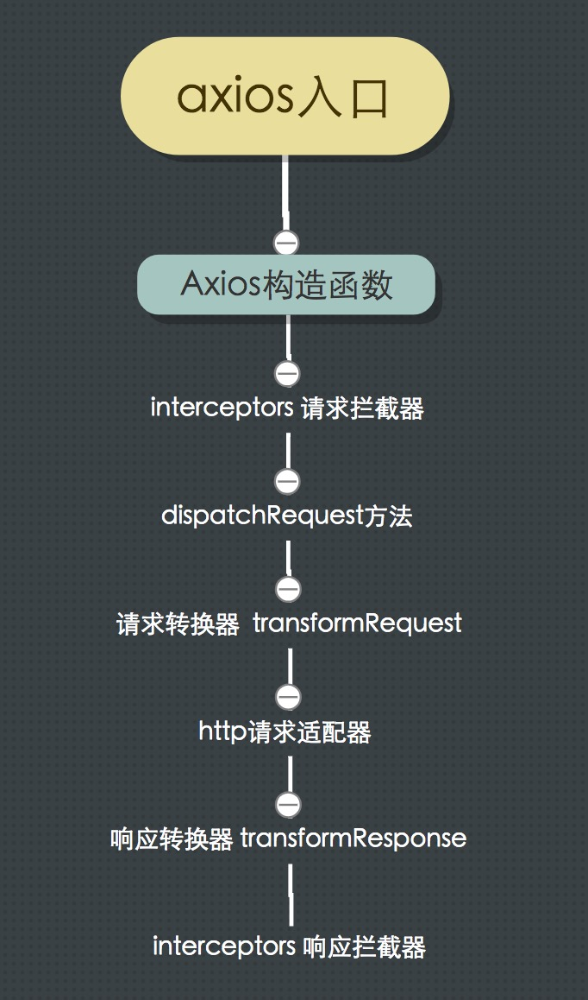

# axios-tutorial
axios源码分析 - XHR篇

[axios](https://github.com/axios/axios) 是一个基于 Promise 的 HTTP 库，可以用在浏览器和node.js中，目前在github上有 42K 的star数

## 分析axios - 目录
备注：每一小节都会从两个方面介绍：如何使用 -> 源码分析

-   [axios项目目录结构](#axios项目目录结构)
-   [名词解释](#名词解释)
-   [axios内部的运作流程图](#axios内部的运作流程图)
-   [工具方法简单介绍](#工具方法简单介绍)
-   [axios为何会有多种使用方式](#axios为何会有多种使用方式)
-   [有多少种配置config的方式](#有多少种配置config的方式)
-   [axios是如何用promise搭起基于xhr的异步桥梁的](#axios是如何用promise搭起基于xhr的异步桥梁的)
-   [header设置](#header设置)
-   [如何取消已经发送的请求](#如何取消已经发送的请求)
-   [自动转换json数据](#自动转换json数据)
-   [跨域携带cookie](#跨域携带cookie)
-   [超时配置及处理](#超时配置及处理)
-   [改写验证成功或失败的规则validatestatus](#改写验证成功或失败的规则validatestatus)
-   [如何拦截请求响应并修改请求参数修改响应数据](#如何拦截请求响应并修改请求参数修改响应数据)
-   [数据转换器-转换请求与响应数据](#数据转换器-转换请求与响应数据)
-   [如何支持客户端xsrf攻击防护](#如何支持客户

端xsrf攻击防护)


## axios的应用和源码解析

### axios项目目录结构

```

├── /dist/                     # 项目输出目录
├── /lib/                      # 项目源码目录
│ ├── /cancel/                 # 定义取消功能
│ ├── /core/                   # 一些核心功能
│ │ ├── Axios.js               # axios的核心主类
│ │ ├── dispatchRequest.js     # 用来调用http请求适配器方法发送请求
│ │ ├── InterceptorManager.js  # 拦截器构造函数
│ │ └── settle.js              # 根据http响应状态，改变Promise的状态
│ ├── /helpers/                # 一些辅助方法
│ ├── /adapters/               # 定义请求的适配器 xhr、http
│ │ ├── http.js                # 实现http适配器
│ │ └── xhr.js                 # 实现xhr适配器
│ ├── axios.js                 # 对外暴露接口
│ ├── defaults.js              # 默认配置 
│ └── utils.js                 # 公用工具
├── package.json               # 项目信息
├── index.d.ts                 # 配置TypeScript的声明文件
└── index.js                   # 入口文件

```

注：因为我们需要要看的代码都是`/lib/`目录下的文件，所以以下所有涉及到文件路径的地方，
我们都会在`/lib/`下进行查找


### 名词解释

-   拦截器 interceptors （其实就是一个构造函数）

    拦截器分为请求拦截器和响应拦截器，顾名思义：
    请求拦截器(`interceptors.request`)是指可以拦截住每次或指定http请求，并可修改配置项
    响应拦截器(`interceptors.response`)可以在每次http请求后拦截住每次或指定http请求，并可修改返回结果项。

    这里先简单说明，后面会做详细的介绍[如何拦截请求响应并修改请求参数修改响应数据](#如何拦截请求响应并修改请求参数修改响应数据)。

-   数据转换器 （其实就是对数据进行转换，比如将对象转换为JSON字符串）

    数据转换器分为请求转换器和响应转换器，顾名思义：
    请求转换器(`transformRequest`)是指在请求前对数据进行转换，
    响应转换器(`transformResponse`)主要对请求响应后的响应体做数据转换。

-   http请求适配器（其实就是一个方法）

    在axios项目里，http请求适配器主要指两种：XHR、http。
    XHR的核心是浏览器端的XMLHttpRequest对象，
    http核心是node的http[s].request方法

    当然，axios也留给了用户通过config自行配置适配器的接口的，
    不过，一般情况下，这两种适配器就能够满足从浏览器端向服务端发请求或者从node的http客户端向服务端发请求的需求。

    本次分享主要围绕XHR。

-   config配置项 （其实就是一个对象）

    此处我们说的config，在项目内不是真的都叫config这个变量名，这个名字是我根据它的用途起的一个名字，方便大家理解。

    在axios项目中的，设置\读取config时，
    有的地方叫它`defaults`(`/lib/defaults.js`)，这儿是默认配置项，
    有的地方叫它`config`，如`Axios.prototype.request`的参数，再如`xhrAdapter`http请求适配器方法的参数。

    config在axios项目里的是非常重要的一条链，是用户跟axios项目内部“通信”的主要桥梁。


### axios内部的运作流程图




### 工具方法简单介绍

有一些方法在项目中多处使用，
所以在正式开始看axios核心代码前，我们先来简单介绍下这些常用方法

特别说明：
axios因为要兼容IE8等老版本浏览器，所以我们会看到一些为了兼容老版本浏览器而写的方法，比如`bind`、`isArray`等

1. bind： 给某个函数指定上下文，也就是this指向

```javascript

bind(fn, context); 

```

实现效果同`Function.prototype.bind`方法: `fn.bind(context)`

2. forEach：遍历数组或对象

```javascript

var utils = require('./utils');
var forEach = utils.forEach;

// 数组
utils.forEach([], (value, index, array) => {})

// 对象
utils.forEach({}, (value, key, object) => {})

```

3. merge：深度合并多个对象为一个对象

```javascript

var utils = require('./utils');
var merge = utils.merge;

var obj1 = {
  a: 1,
  b: {
    bb: 11,
    bbb: 111,
  }
};
var obj2 = {
  a: 2,
  b: {
    bb: 22,
  }
};
var mergedObj = merge(obj1, obj2); 

```

mergedObj对象是：
`{ 
  a: 2, 
  b: { 
    bb: 22, 
    bbb: 111 
  } 
}`


4. extend：将一个对象的方法和属性扩展到另外一个对象上，并指定上下文

```javascript

var utils = require('./utils');
var extend = utils.extend;

var context = {
  a: 4,
};
var target = {
  k: 'k1',
  fn(){
    console.log(this.a + 1)
  }
};
var source = {
  k: 'k2',
  fn(){
    console.log(this.a - 1)
  }
};
let extendObj = extend(target, source, context);

```

extendObj对象是：
`{
  k: 'k2',
  fn: source.fn.bind(context),
}`
执行`extendObj.fn();`, 打印`3`


### axios为何会有多种使用方式

#### 如何使用

```javascript
// 首先将axios包引进来
import axios from 'axios'
```

第1种使用方式：`axios(option)`
```javascript
axios({
  url,
  method,
  headers,
})
```

第2种使用方式：`axios(url[, option])`
```javascript
axios(url, {
  method,
  headers,
})
```

第3种使用方式（对于`get、delete`等方法）：`axios[method](url[, option])`
```javascript
axios.get(url, {
  headers,
})
```

第4种使用方式（对于`post、put`等方法）：`axios[method](url[, data[, option]])`
```javascript
axios.get(url, {
  headers,
})
```

第5种使用方式：`axios.request(option)`
```javascript
axios.request({
  url,
  method,
  headers,
})
```

#### 源码分析

在开始讲axios为何有这么多种使用方式前，我们先来看下Axios构造函数
Axios是axios包的核心，一个Axios实例就是一个axios应用，其他方法都是对Axios内容的扩展
而Axios构造函数的核心方法是request方法，各种axios的调用方式最终都是通过request方法发xhr或http请求的，
下面讲到axios是[axios是如何用promise搭起基于xhr的异步桥梁的](#axios是如何用promise搭起基于xhr的异步桥梁的)、[如何拦截请求响应并修改请求参数修改响应数据](#如何拦截请求响应并修改请求参数修改响应数据)时，会着重看这块代码。

```javascript


function Axios(instanceConfig) {
  this.defaults = instanceConfig;
  this.interceptors = {
    request: new InterceptorManager(),
    response: new InterceptorManager()
  };
}

Axios.prototype.request = function request(config) {
  // ...省略代码
};

// 为支持的请求方法提供别名
utils.forEach(['delete', 'get', 'head', 'options'], function forEachMethodNoData(method) {
  Axios.prototype[method] = function(url, config) {
    return this.request(utils.merge(config || {}, {
      method: method,
      url: url
    }));
  };
});
utils.forEach(['post', 'put', 'patch'], function forEachMethodWithData(method) {
  Axios.prototype[method] = function(url, data, config) {
    return this.request(utils.merge(config || {}, {
      method: method,
      url: url,
      data: data
    }));
  };
});

```

能够实现多种axios使用方式的核心是`createInstance`方法：

```javascript

// /lib/axios.js  -  14行
function createInstance(defaultConfig) {
  // 创建一个Axios实例
  var context = new Axios(defaultConfig);

  // 不考虑老浏览器，以下代码也可以这样实现：var instance = Axios.prototype.request.bind(context);
  // 这样instance就指向了request方法，且上下文指向context，所以可以直接以 instance(option) 方式调用 
  // Axios.prototype.request 内对第一个参数的数据类型判断，使我们能够以 instance(url, option) 方式调用
  var instance = bind(Axios.prototype.request, context);

  // 把Axios.prototype上的方法扩展到instance对象上，
  // 这样 instance 就有了 get、post、put等方法
  // 并指定上下文为context，这样执行Axios原型链上的方法时，this会指向context
  utils.extend(instance, Axios.prototype, context);

  // 把context对象上的自身属性和方法扩展到instance上
  // 注：因为extend内部使用的forEach方法对对象做for in 遍历时，只遍历对象本身的属性，而不会遍历原型链上的属性
  // 这样，instance 就有了  defaults、interceptors 属性。（这两个属性后面我们会介绍）
  utils.extend(instance, context);

  return instance;
}

// 接收默认配置项作为参数（后面会介绍配置项），创建一个Axios实例，最终会被作为对象导出
var axios = createInstance(defaults);

/**
 * 一般情况，项目使用默认导出的axios实例就可以满足需求了，
 * 如果不满足需求需要创建新的axios实例，axios包也预留了接口，
 * 看下面的代码：
 */
// /lib/axios.js  -  31行
axios.Axios = Axios;
axios.create = function create(instanceConfig) {
  return createInstance(utils.merge(defaults, instanceConfig));
};

module.exports = axios;

```


### 有多少种配置config的方式

这里说的`config`，指的是贯穿整个项目的配置项对象，
通过这个对象，可以设置：

`http请求适配器、请求地址、请求方法、请求头header、
请求数据、请求或响应数据的转换、请求进度、http状态码验证规则、超时、取消请求等`

可以发现，几乎`axios`所有的功能都是通过这个对象进行配置和传递的，
既是`axios`项目内部的沟通桥梁，也是用户跟`axios`进行沟通的桥梁。

首先我们看看，用户能以什么方式定义配置项？

```javascript

import axios from 'axios'

// 第1种：直接修改Axios实例上defaults属性
axios.defaults[configName] = value;

// 第2种：发起请求时最终会调用Axios.prototype.request方法，然后传入配置项
axios({
  url,
  method,
  headers,
})

// 第3种：新建一个Axios实例，传入配置项
let newAxiosInstance = axios.create({
  [configName]: value,
})

```

看下 `Axios.prototype.request` 方法里的一行代码: (`/lib/core/Axios.js`  -  第35行)

```javascript

config = utils.merge(defaults, {method: 'get'}, this.defaults, config);

```

可以发现此处将默认配置对象`defaults`（`/lib/defaults.js`）、Axios实例属性`this.defaults`、`request`请求的参数`config`进行了合并。
由此得出，多处配置的优先级由低到高是：

默认配置对象`defaults`（`/lib/defaults.js`)
 ↓
{ method: 'get' }
 ↓
Axios实例属性`this.defaults`
 ↓
`request`请求的参数`config`

至此，我们已经得到了将多处`merge`后的`config`对象，那么这个对象在项目中又是怎样传递的呢？

```javascript

Axios.prototype.request = function request(config) {
  // ...
  config = utils.merge(defaults, {method: 'get'}, this.defaults, config);

  var chain = [dispatchRequest, undefined];
  // 将config对象当作参数传给Primise.resolve方法
  var promise = Promise.resolve(config);

  this.interceptors.request.forEach(function unshiftRequestInterceptors(interceptor) {
    chain.unshift(interceptor.fulfilled, interceptor.rejected);
  });

  this.interceptors.response.forEach(function pushResponseInterceptors(interceptor) {
    chain.push(interceptor.fulfilled, interceptor.rejected);
  });

  while (chain.length) {
    // 注：因为我们此处是在梳理config的传递过程，所以我们暂且只讨论promise的状态为rejected的情况
    // promise第1次执行.then方法时，.then方法第一参数（也就是成功后的回调）接收到的参数是config对象

    // promise的.then方法接收的第一个参数有3种情况：

    // 1，this.interceptors.request.handlers 数组长度大于0时
    // promise.then第一个会接收this.interceptors.request.handlers的最后一项的fulfilled函数作为成功回调
    // 该回调会接收一个config对象，在这里我们可以对config进行修改
    // 且该回调会返回一个修改后config对象（这是axios内对拦截器的约定）
    // 然后依次取出当前项的前一项作为成功回调函数
    // 此处不展开介绍了，后面[如何拦截请求响应并修改请求参数修改响应数据]一节会详细对拦截器进行说明

    // 2，dispatchRequest (关于dispatchRequest的介绍，请往下移步大约25行
    
    ： dispatchRequest都做了哪些事？)
      // dispatchRequest方法会返回一个response对象

    // 3，this.interceptors.response.handlers 数组长度大于0时
    // promise.then第一个会接收this.interceptors.response.handlers的第一项的fulfilled函数作为成功回调
    // 该回调会接收一个response对象，在这里我们可以对response对象进行修改
    // 且该回调会返回一个修改后response对象（这是axios内对拦截器的约定）
    // 然后依次使用当前项的后一项作为成功回调函数
    // 此处不展开介绍了，后面[如何拦截请求响应并修改请求参数修改响应数据]一节会详细对拦截器进行说明

    // 因为此处是用Promise进行依次链接的，


    // 所以我们可以在拦截器里进行异步操作，而执行顺序会按照同步的方式执行
    // 也就是 dispatchRequest 方法一定会等待所有的request拦截器执行完后再开始执行，
    // response拦截器一定会等待 dispatchRequest 执行完后再开始执行。

    promise = promise.then(chain.shift(), chain.shift());
  }

  return promise;
};

```

#### dispatchRequest都做了哪些事？

dispatchRequest主要做了3件事：
1，拿到config对象，对config进行传给http请求适配器前的最后处理；
2，http请求适配器根据config配置，发起请求
3，http请求适配器请求完成后，如果成功则根据header、data、和config.transformResponse（关于transformResponse，下面的[数据转换器-转换请求与响应数据](#数据转换器-转换请求与响应数据)会进行讲解）拿到数据转换后的response，并return。

```javascript

// /lib/core/dispatchRequest.js
module.exports = function dispatchRequest(config) {
  throwIfCancellationRequested(config);

  // Support baseURL config
  if (config.baseURL && !isAbsoluteURL(config.url)) {
    config.url = combineURLs(config.baseURL, config.url);
  }

  // Ensure headers exist
  config.headers = config.headers || {};

  // 对请求data进行转换
  config.data = transformData(
    config.data,
    config.headers,
    config.transformRequest
  );

  // 对header进行合并处理
  config.headers = utils.merge(
    config.headers.common || {},
    config.headers[config.method] || {},
    config.headers || {}
  );

  // 删除header属性里无用的属性
  utils.forEach(
    ['delete', 'get', 'head', 'post', 'put', 'patch', 'common'],
    function cleanHeaderConfig(method) {
      delete config.headers[method];
    }
  );

  // http请求适配器会优先使用config上自定义的适配器，没有配置时才会使用默认的XHR或http适配器，不过大部分时候，axios提供的默认适配器是能够满足我们的
  var adapter = config.adapter || defaults.adapter;

  return adapter(config).then(function onAdapterResolution(response) {
    throwIfCancellationRequested(config);

    // Transform response data
    response.data = transformData(
      response.data,
      response.headers,
      config.transformResponse
    );

    return response;
  }, function onAdapterRejection(reason) {
    if (!isCancel(reason)) {
      throwIfCancellationRequested(config);

      // Transform response data
      if (reason && reason.response) {
        reason.response.data = transformData(
          reason.response.data,
          reason.response.headers,
          config.transformResponse
        );
      }
    }

    return Promise.reject(reason);
  });
};

```

至此，`config`走完了它传奇的一生。`-_-`


### axios是如何用promise搭起基于xhr的异步桥梁的
axios是如何通过Promise进行异步处理的？

#### 如何使用

```javascript

import axios from 'axios'

axios.get(/**/)
.then(data => {
  // 此处可以拿到向服务端请求回的数据
})
.catch(error => {
  // 此处可以拿到请求失败或取消或其他处理失败的错误对象
})

```

#### 源码分析

```javascript

Axios.prototype.request = function request(config) {
  // ...
  var chain = [dispatchRequest, undefined];
  // 将config对象当作参数传给Primise.resolve方法
  var promise = Promise.resolve(config);

  while (chain.length) {
    promise = promise.then(chain.shift(), chain.shift());
  }

  return promise;
};

```

通过[axios为何会有多种使用方式](#axios为何会有多种使用方式)我们知道，
用户无论以什么方式调用axios，最终都是调用的`Axios.prototype.request`方法，
这个方法最终返回的是一个Promise对象。

`Axios.prototype.request`方法会调用`dispatchRequest`(`/lib/core/dispatchRequest.js`)方法，而`dispatchRequest`方法会调用`xhrAdapter`方法(`/lib/adapters/xhr.js`),
`xhrAdapter`方法返回的是一个Promise对象。

```javascript

// /lib/adapters/xhr.js
function xhrAdapter(config) {
  return new Promise(function dispatchXhrRequest(resolve, reject) {
    // ... 省略代码
  });
};

```

`xhrAdapter`内的XHR请求成功时会执行这个Promise对象的`resolve`方法,并将请求的数据传出去,

```javascript

// /lib/adapters/xhr.js
var request = new XMLHttpRequest();
var loadEvent = 'onreadystatechange';

request[loadEvent] = function handleLoad() {
      
  settle(resolve, reject, response);

};

```

反之则执行`reject`方法，并将错误信息作为参数传出去。

而在`dispatchRequest`方法内，首先得到`xhrAdapter`方法返回的Promise对象,
然后通过`.then`方法，对`xhrAdapter`返回的Promise对象的成功或失败结果进行二次处理，
成功的话，则将处理后的`response`返回，
失败的话，则返回一个状态为`rejected`的Promise对象，

```javascript

  return adapter(config).then(function onAdapterResolution(response) {
    // ...
    return response;
  }, function onAdapterRejection(reason) {
    // ...
    return Promise.reject(reason);
  });
};

```

那么至此，用户调用`axios()`方法时，就可以直接调用Promise的`.then`或`.catch`进行业务处理了。


### header设置

#### 如何使用

``` javascript

import axios from 'axios'

// 设置通用header
axios.defaults.headers.common['X-Requested-With'] = 'XMLHttpRequest'; // xhr标识

// 设置某种请求的header
axios.defaults.headers.post['Content-Type'] = 'application/x-www-form-urlencoded;charset=utf-8';

// 设置某次请求的header
axios.get(url, {
  headers: {
    'Authorization': 'whr1',
  },
})

```

#### 源码分析

``` javascript

// /lib/core/dispatchRequest.js  -  44行

  config.headers = utils.merge(
    config.headers.common || {},
    config.headers[config.method] || {},
    config.headers || {}
  );

```


### 如何取消已经发送的请求

#### 如何使用

```javascript

import axios from 'axios'

// 第一种取消方法
axios.get(url, {
  cancelToken: new axios.CancelToken(cancel => {
    if (/* 取消条件 */) {
      cancel('取消日志');
    }
  })
});

// 第二种取消方法
const CancelToken = axios.CancelToken;
const source = CancelToken.source();
axios.get(url, {
  cancelToken: source.token
});
source.cancel('取消日志');

```

#### 源码分析

```javascript

// /cancel/CancelToken.js  -  11行
function CancelToken(executor) {
 
  var resolvePromise;
  this.promise = new Promise(function promiseExecutor(resolve) {
    resolvePromise = resolve;
  });
  var token = this;
  executor(function cancel(message) {
    if (token.reason) {
      return;
    }
    token.reason = new Cancel(message);
    resolvePromise(token.reason);
  });
}

// /lib/adapters/xhr.js  -  159行
if (config.cancelToken) {
    config.cancelToken.promise.then(function onCanceled(cancel) {
        if (!request) {
            return;
        }
        request.abort();
        reject(cancel);
        request = null;
    });
}

```

取消功能的核心是通过CancelToken内的`this.promise = new Promise(resolve => resolvePromise = resolve)`，
得到实例属性`promise`，此时该`promise`的状态为`pending`
通过这个属性，在`/lib/adapters/xhr.js`文件中继续给这个`promise`实例添加`.then`方法
（`xhr.js`文件的159行`config.cancelToken.promise.then(message => request.abort())`）；

在`CancelToken`外界，通过`executor`参数拿到对`cancel`方法的控制权，
这样当执行`cancel`方法时就可以改变实例的`promise`属性的状态为`rejected`，
从而执行`request.abort()`方法达到取消请求的目的。

上面第二种写法可以看作是对第一种写法的完善，
因为很多是时候我们取消请求的方法是用在本次请求方法外，
例如，发送A、B两个请求，当B请求成功后，取消A请求。

```javascript

// 第1种写法：
let source;
axios.get(Aurl, {
  cancelToken: new axios.CancelToken(cancel => {
    source = cancel;
  })
});
axios.get(Burl)
.then(() => source('B请求成功了'));

// 第2种写法：
const CancelToken = axios.CancelToken;
const source = CancelToken.source();
axios.get(Aurl, {
  cancelToken: source.token
});
axios.get(Burl)
.then(() => source.cancel('B请求成功了'));

```

相对来说，我更推崇第1种写法，因为第2种写法太隐蔽了，不如第一种直观好理解。


##### 发现的问题

1. /lib/adapters/xhr.js文件中，onCanceled方法的参数不应该叫message么，为什么叫cancel？

2. /lib/adapters/xhr.js文件中，onCanceled方法里，reject里应该将config信息也传出来


### 自动转换json数据

在默认情况下，axios将会自动的将传入的data对象序列化为JSON字符串，将响应数据中的JSON字符串转换为JavaScript对象

#### 源码分析

```javascript

// 请求时，将data数据转换为JSON 字符串
// /lib/defaults.js 
transformRequest: [function transformRequest(data, headers) {
  // ...
    if (utils.isObject(data)) {
      setContentTypeIfUnset(headers, 'application/json;charset=utf-8');
      return JSON.stringify(data);
    }
    return data;
}]

// 得到响应后，将请求到的数据转换为JSON对象
// /lib/defaults.js
transformResponse: [function transformResponse(data) {
    if (typeof data === 'string') {
      try {
        data = JSON.parse(data);
      } catch (e) { /* Ignore */ }
    }
    return data;
}]

```


### 跨域携带cookie

#### 如何使用

```javascript 

import axios from 'axios'

axios.defaults.withCredentials = true;

```

#### 源码分析

我们在[有多少种配置config的方式](#有多少种配置config的方式)一节已经介绍了config在axios项目里的传递过程，
由此得出，我们通过`axios.defaults.withCredentials = true`做的配置，
在`/lib/adapters/xhr.js`里是可以取到的，然后通过以下代码配置到xhr对象项。

```javascript

var request = new XMLHttpRequest();

// /lib/adapters/xhr.js  -  132行
if (config.withCredentials) {
  request.withCredentials = true;
}

```


### 超时配置及处理

#### 如何使用

```javascript

import axios from 'axios'

axios.defaults.timeout = 3000;

```

#### 源码分析

```javascript

// /adapters/xhr.js  -  48行
request.timeout = config.timeout;

// /adapters/xhr.js  -  94行
request.ontimeout = function handleTimeout() {
  reject(createError('timeout of ' + config.timeout + 'ms exceeded', 
    config, 'ECONNABORTED', request));
};

```

-   axios库外如何添加超时后的处理

```javascript

axios().catch(error => {
  const { message } = error;
  if (message.indexOf('timeout') > -1){
    // 超时处理
  }
})

```


### 改写验证成功或失败的规则validatestatus
自定义`http`状态码的成功、失败范围

#### 如何使用

```javascript

import axios from 'axios'

axios.defaults.validateStatus = status => status >= 200 && status < 300;

```

#### 源码分析

在默认配置中，定义了默认的http状态码验证规则，
所以自定义validateStatus其实是对此处方法的重写
`/lib/defaults.js`  -  77行

```javascript

var defaults = {
  // ...
  validateStatus: function validateStatus(status) {
    return status >= 200 && status < 300;
  },
  // ...
}

```

`axios`是何时开始验证`http`状态码的？

```javascript

// /lib/adapters/xhr.js  -  20行
var request = new XMLHttpRequest();
var loadEvent = 'onreadystatechange';

// /lib/adapters/xhr.js  -  77行
// 每当 readyState 改变时，就会触发 onreadystatechange 事件
request[loadEvent] = function handleLoad() {
  if (!request || (request.readyState !== 4 && !xDomain)) {
    return;
  }
  // ...省略代码
  var response = {
      // ...
      // IE sends 1223 instead of 204 (https://github.com/axios/axios/issues/201)
      status: request.status === 1223 ? 204 : request.status,
      config: config,
  };
  settle(resolve, reject, response);
  // ...省略代码
}

```

/lib/core/settle.js  -  12行

```javascript

function settle(resolve, reject, response) {
  // 如果我们往上捣一捣就会发现，config对象的validateStatus就是我们自定义的validateStatus方法或默认的validateStatus方法
  var validateStatus = response.config.validateStatus;
  // validateStatus验证通过，就会触发resolve方法
  if (!response.status || !validateStatus || validateStatus(response.status)) {
    resolve(response);
  } else {
    reject(createError(
      'Request failed with status code ' + response.status,
      response.config,
      null,
      response.request,
      response
    ));
  }
};

```


### 如何拦截请求响应并修改请求参数修改响应数据

#### 如何使用

```javascript

// 添加请求拦截器
const myRequestInterceptor = axios.interceptors.request.use(config => {
    // 在发送http请求之前做些什么
    return config; // 有且必须有一个config对象被返回
}, error => {
    // 对请求错误做些什么
    return Promise.reject(error);
});

// 添加响应拦截器
axios.interceptors.response.use(response => {
  // 对响应数据做点什么
  return response; // 有且必须有一个response对象被返回
}, error => {
  // 对响应错误做点什么
  return Promise.reject(error);
});

// 移除某次拦截器
axios.interceptors.request.eject(myRequestInterceptor);

```

#### 思考

```javascript

axios.interceptors.request.use(config => config, error => {
  // 是否可以直接 return error ？
  return Promise.reject(error); 
});

```

#### 源码分析

关于拦截器，[名词解释](#名词解释)一节已经做过简单说明。

每个axios实例都有一个`interceptors`实例属性，
`interceptors`对象上有两个属性`request`、`response`。

```javascript

function Axios(instanceConfig) {
  // ...
  this.interceptors = {
    request: new InterceptorManager(),
    response: new InterceptorManager()
  };
}

```

这两个属性都是一个`InterceptorManager`实例，而这个`InterceptorManager`构造函数就是用来管理拦截器的。

我们先来看看`InterceptorManager`构造函数：

`InterceptorManager`构造函数就是用来实现拦截器的，这个构造函数原型上有3个方法：use、eject、forEach。
关于源码，其实是比较简单的，都是用来操作该构造函数的handlers实例属性的。


```javascript

// /lib/core/InterceptorManager.js

function InterceptorManager() {
  this.handlers = []; // 存放拦截器方法，数组内每一项都是有两个属性的对象，两个属性分别对应成功和失败后执行的函数。
}

// 往拦截器里添加拦截方法
InterceptorManager.prototype.use = function use(fulfilled, rejected) {
  this.handlers.push({
    fulfilled: fulfilled,
    rejected: rejected
  });
  return this.handlers.length - 1;
};

// 用来注销指定的拦截器
InterceptorManager.prototype.eject = function eject(id) {
  if (this.handlers[id]) {
    this.handlers[id] = null;
  }
};

// 遍历this.handlers，并将this.handlers里的每一项作为参数传给fn执行
InterceptorManager.prototype.forEach = function forEach(fn) {
  utils.forEach(this.handlers, function forEachHandler(h) {
    if (h !== null) {
      fn(h);
    }
  });
};


```

那么当我们通过axios.interceptors.request.use添加拦截器后，
axios内部又是怎么让这些拦截器能够在请求前、请求后拿到我们想要的数据的呢？

```javascript

Axios.prototype.request = function request(config) {
  // ...
  var chain = [dispatchRequest, undefined];
  var promise = Promise.resolve(config);

  this.interceptors.request.forEach(function unshiftRequestInterceptors(interceptor) {
    chain.unshift(interceptor.fulfilled, interceptor.rejected);
  });

  this.interceptors.response.forEach(function pushResponseInterceptors(interceptor) {
    chain.push(interceptor.fulfilled, interceptor.rejected);
  });

  while (chain.length) {
    promise = promise.then(chain.shift(), chain.shift());
  }

  return promise;
};

```

核心就是promise的链式调用


### 数据转换器-转换请求与响应数据

#### 如何使用

1. 修改全局的转换器

```javascript

import axios from 'axios'

// 往现有的请求转换器里增加转换方法
axios.defaults.transformRequest.push((data, headers) => {
  // ...处理data
  return data;
});

// 重写请求转换器
axios.defaults.transformRequest = [(data, headers) => {
  // ...处理data
  return data;
}];

// 往现有的响应转换器里增加转换方法
axios.defaults.transformResponse.push((data, headers) => {
  // ...处理data
  return data;
});

// 重写响应转换器
axios.defaults.transformResponse = [(data, headers) => {
  // ...处理data
  return data;
}];

```

2. 修改某次axios请求的转换器

```javascript

import axios from 'axios'

// 往已经存在的转换器里增加转换方法
axios.get(url, {
  // ...
  transformRequest: [
    ...axios.axios.defaults.transformRequest, // 去掉这行代码就等于重写请求转换器了
    (data, headers) => {
      // ...处理data
      return data;
    }
  ],
  transformResponse: [
    ...axios.axios.defaults.transformResponse, // 去掉这行代码就等于重写响应转换器了
    (data, headers) => {
      // ...处理data
      return data;
    }
  ],
})

```

#### 源码分析

默认的`defaults`配置项里已经自定义了一个请求转换器和一个响应转换器，
看如下代码：

```javascript

// /lib/defaults.js
var defaults = {

  transformRequest: [function transformRequest(data, headers) {
    normalizeHeaderName(headers, 'Content-Type');
    // ...
    if (utils.isArrayBufferView(data)) {
      return data.buffer;
    }
    if (utils.isURLSearchParams(data)) {
      setContentTypeIfUnset(headers, 'application/x-www-form-urlencoded;charset=utf-8');
      return data.toString();
    }
    if (utils.isObject(data)) {
      setContentTypeIfUnset(headers, 'application/json;charset=utf-8');
      return JSON.stringify(data);
    }
    return data;
  }],

  transformResponse: [function transformResponse(data) {
    if (typeof data === 'string') {
      try {
        data = JSON.parse(data);
      } catch (e) { /* Ignore */ }
    }
    return data;
  }],
  
};

```

那么在axios项目里，是在什么地方使用了转换器呢？

请求转换器的使用地方是http请求前，使用请求转换器对请求数据做处理，
然后传给http请求适配器使用。

```javascript

// /lib/core/dispatchRequest.js
function dispatchRequest(config) {
  
  config.data = transformData(
    config.data,
    config.headers,
    config.transformRequest
  );

  return adapter(config).then(/* ... */);
};

```

看下`transformData`方法的代码，
主要遍历转换器数组，分别执行每一个转换器，根据data和headers参数，返回新的data。

```javascript

// /lib/core/transformData.js
function transformData(data, headers, fns) {
  utils.forEach(fns, function transform(fn) {
    data = fn(data, headers);
  });
  return data;
};

```

响应转换器的使用地方是在发起http请求后，根据http请求适配器的返回值做数据转换处理：

```javascript

// /lib/core/dispatchRequest.js
return adapter(config).then(function onAdapterResolution(response) {
    // ...
    response.data = transformData(
      response.data,
      response.headers,
      config.transformResponse
    );

    return response;
  }, function onAdapterRejection(reason) {
    if (!isCancel(reason)) {
      // ...
      if (reason && reason.response) {
        reason.response.data = transformData(
          reason.response.data,
          reason.response.headers,
          config.transformResponse
        );
      }
    }

    return Promise.reject(reason);
  });

```

#### 转换器和拦截器的关系？

拦截器同样可以实现转换请求和响应数据的需求，但根据作者的设计和综合代码可以看出，
在请求时，拦截器主要负责修改config配置项，数据转换器主要负责转换请求体，比如转换对象为字符串
在请求响应后，拦截器可以拿到`response`，数据转换器主要负责处理响应体，比如转换字符串为对象。


### 如何支持客户端xsrf攻击防护

#### 如何使用

#### 源码分析
